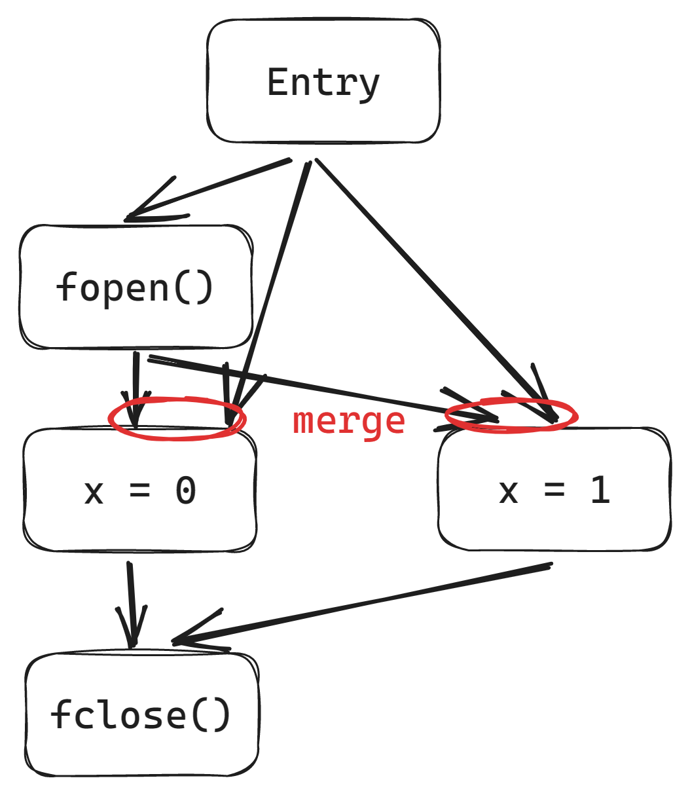

<div class="center middle">
<div style="width: 100%; margin-top: -200px;">

# ESP：Path-Sensitive Program Verification in Polynomial Time

</div>
</div>

<div style="width: 100%; margin-top: -250px;">

> 作者：Manuvir Das, Sorin Lerner, Mark Seigle
> 
> 单位：Microsoft Research, University of Washington
> 
> 会议：PLDI' 02
> 
> 链接：https://dl.acm.org/doi/abs/10.1145/512529.512538

</div>

<div class="center">
<div style="width: 100%; margin-top: 50px;">

Jiachen Lu 2023.6

</div>
</div>


<!--s-->

<div class="middle center">
<div style="width: 100%">

# 1. Introduction

</div>
</div>

<!--v-->

## Introduction(high level)
- **Motivation.** At a high level, what is the problem are you/the authors are working in and why is it important?

<hr/>

- 程序分析技术已被用于构建用于partial verification的工具。
- 部分验证用 有限状态机编写 的 时序安全属性 作为输入，然后用一些工具检测有限状态机的状态，如果不会到达错误状态，说明程序具有某种安全属性。
- paritial verification主要基于路径敏感的程序分析方法，因为只有路径敏感对于验证来说才足够准确。
- 但是路径敏感带来的代价通常很大，因为状态会沿着不同路径指数增长

<hr/>

### So?

如何增大路径敏感算法的scalability是一个需要解决的问题。

<!--v-->

## Introduction(low level)

- **Motivation.** What is the specific problem considered in this work? This slides narrows down the topic area of the current work.

<hr/>

对于要检查的特定属性而言，程序中的大多数分支都与该属性无关。

- Problem 1 : 如何识别和跟踪无关分支做到状态合并？

<!--v-->

## Literature and Existing Efforts

- At a high level what are the existing works to tackle the problems mentioned in your Slide 2.

- **Path-sensitive analysis.**
- **Standard dataflow analysis.**

Dataflow Analysis: How Data facts Flows on CFG?

<!--v-->

## Limitations of Existing Works

判断上述程序是否正确调用fopen和fclose，比如只有在open的时候才能close。

<div class="mul-cols">
<div class="col">

**Path-sensitive analysis.** 到达l label前，有如下所示四个可能的状态。需要避免 \$uninit状态进入l语句。

虽然这种分析可以相对精确的得到结果,但是也在状态中引入了过多的无关状态,导致分析效率低下。

状态数 = 2 * 2，两个分支，每个分支两个状态。

$$
\begin{aligned}
\mathrm{ \langle uninit, \neg dump, \neg p, x = 1 \rangle \quad
\langle Opened, \neg dump, \neg p, x = 1 \rangle }  \newline
\mathrm{ \langle uninit, \neg dump, p, x = 0 \rangle\quad
\langle Opened, \neg dump, p, x = 0 \rangle  }
\end{aligned}
$$

</div>

<div class="col" style="width: 85%">
<!-- <div style="width: 85%"> -->

```
void main(){
	if (dump)
		f = fopen(dumpFil, "w");  //Open
	if (p)
		x = 0;
	else
		x = 1;
l:  if (dump)
		fclose(f); // close
}
```

</div>
</div>


<!--v-->

## Limitations of Existing Works

判断上述程序是否正确调用fopen和fclose，比如只有在open的时候才能close。

<div class="mul-cols">
<div class="col">

**Standard dataflow analysis.** 状态在CFG的join point上合并了，dump状态的信息就丢失了，只有一个$\langle \[ uninit, Opened \] \rangle$ 的状态会到达label l，导致误报。

上述状态含义：可能uninit，可能open。

```
void main(){
	if (dump)
		f = fopen(dumpFil, "w");  //Open
	if (p)
		x = 0;
	else
		x = 1;
l:  if (dump)
		fclose(f); // close
}
```


</div>

<!-- <div class="col"> -->
<div class="col" style="width: 70%">



</div>
</div>


<!--s-->

<div class="middle center">
<div style="width: 100%">

# 2. This Paper

</div>
</div>

<!--v-->

## This Paper’s Insight

- 对于要检查的特定属性而言，程序中的大多数分支都与该属性无关。

<hr/>

### Challenges

如何识别和跟踪无关分支做到状态合并？

<!--v-->

## Property Simulation

A general framework for tracking **property states** and **execution states** using **path-sensitive dataflow analysis**.

Key Idea: 将状态区分成两类，一类是property states，一类是execution states。

<div class="mul-cols">
<div class="col">

右边的例子中，只有f的状态是我们关注的property states，其他的状态都是execution states，比如dump、p、x。

<hr/>

如何形式化的表示状态合并和状态转移？

先补充一些简单的数据流分析的知识。

</div>
<div class="col" style="width: 85%">

```
void main(){
	if (dump)
		f = fopen(dumpFil, "w");  //Open
	if (p)
		x = 0;
	else
		x = 1;
l:  if (dump)
		fclose(f); // close
}
```

</div>
</div>

<!--v-->

## Property Simulation Framework

A data flow analysis framework (D, L, F) consists of:
- D: a direction of data flow: forwards or backwards
- L: a lattice including domain of the values V and a meet ⊓ or join ⊔ operator
- F: a family of transfer functions from V to V

<hr/>

- D: forward
- L: $2^S$
  - S 是symbolic state的域，symbolic state是一个包含abstract state和execution state的元组，abstract state是property states的集合。
  - 这句话可能有点绕，后面有例子
- F: 对于不同的节点情况，有三种不同的F。

<!--v-->

## Property Simulation Function

CFG有三种节点：merge nodes有两个前驱、branch nodes有一个前驱，两个后继（一个true一个false）、computation nodes有一个前驱一个后继；分别对应三种不同的transfer function。

Three types flow function：
- $F_{mrg}(n,ss_1,ss_2)=\alpha(ss_1\cup ss_2)$ combines the dataflow facts on its input edges into a single fact, using set union.
- $F_{br}(n,ss,val)=\alpha(\{s'|s'=f_{br}(n,s,val)\wedge s\in ss\wedge es(s')\neq \bot\})$ 
	- $f_{br}$ maps input state to output state.
	- $f_{br}$ effects: （1）使用执行状态中的信息和定理证明器来确定给定分支方向是否可行。 （2）如果不能根据目前的状态判定不可达，而且新状态也在execution state中，就当可以到达并更新状态。
- $F_{oth}(n,ss)=\alpha(\{f_{oth}(n,s)|s\in ss\})$ 
	- $f_{oth}$ the transfer function for computation nodes.

mrg: merge; br: branch; oth: other n: node; ss: symbolic states set; 

<font color="red">三种不同分析的区别主要在group函数α上</font> 

<font color="red">group函数的作用是描述状态应该如何合并</font>

<!--v-->

## Property Simulation Group Function


三种不同的属性分析使用的三种不同的α函数

**Fully path-sensitive analysis.** $\alpha_{cs}(ss)=ss$ 这种情况下，合并节点记录了前驱节点的所有信息。

非形式化描述：所有状态都不合并

**Standard dataflow analysis.** $\alpha_{df}=\{[\bigcup_{s\in ss}as(s),\bigsqcup_{s\in ss}es(s)]\}$ 这种情况下，α函数合并symbolic states set中的所有状态为一个状态。这种合并导致了property state和产生这个属性状态的execution state之间的关系丢失了。

非形式化描述：所有状态都合并

**Property simulation.** 基于property state，"group" symbolic states。同一组的exectuion states都被合并，（e.g. $\alpha_{as}(\{[{a},l], [{a},m],\}) = \{[{a},l\sqcup m]\}$。这种合并保留了property state和产生这个属性状态的execution state之间的相关性。

$$
\begin{aligned}
\alpha_{as}(ss) = \{[\{d\},\bigsqcup_{s\in ss[d]} es(d)]|d\in D\wedge ss[d]\neq\phi\} \newline
\mathrm{where}\ ss[d] = \{s|s\in ss\wedge d\in as(s)\}
\end{aligned}
$$

非形式化描述：状态选择合并

<!--v-->

## Property Simulation Example

<div class="mul-cols">
<div class="col" style="width: 85%">

1. 定理证明器没有足够的信息来确定n1分支的方向，所以symbolic state分裂了，分别传播\[\$u, d\]和\[\$u, !d\]向后继节点。
2. n2把\$转成o，把\[o,d\]传给后继节点
3. n3合并状态（对于PropSim合了但是完全没合，Dataflow就不行了
4. 定理证明器又不能判断分支方向，所以symbolic state继续分裂，分成{\[\$u, p!d\], \[o, pd\]} 和 {\[\$u, !p!d\], \[o, !pd\]} 传给n4
5. 简单赋值
6. 简单赋值
7. 合并，其中PropSim删除了无关的p状态，然后合并
8. 定理证明器可以判断d在给定的情况下哪一条分支是可行的，不用分裂，分别传给后继节点。
9. 把 o -> \$u

</div>
<div class="col">


</div>
</div>

<!--s-->

<div class="middle center">
<div style="width: 100%">

# 3. Evaluation

</div>
</div>

<!--v-->

## Evaluation

- Experimental Set Up
  - A version of GCC from SPEC95(with a few changes), 14000 LOC, 2149 fucntions
  - property states: fprintf状态
  - On 1GHz Pentium III, 512MB RAM, Windows XP

</br>

|         | RunTime(secs) | MemUsage(MB) |
|:-------:|:-------------:|:------------:|
| Average |      72.9     |     49.7     |
| Maximum |      170      |      102     |


<!--s-->

<div class="middle center">
<div style="width: 100%">

# 4. Summary

</div>
</div>

<!--v-->

# Take-away Notes
1. 对数据流分析建立基础的认识
2. 理解本文通过将程序状态划分成 property states 和 execution states 做多项式时间的数据流分析的方式


<!--v-->

<div class="middle center">
<div style="width: 100%">

# Thank You

</div>
</div>